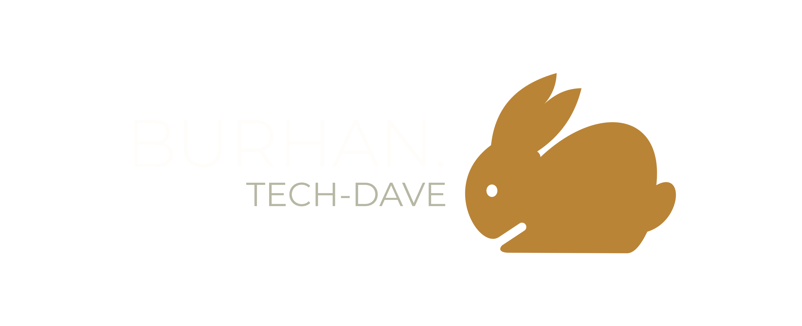
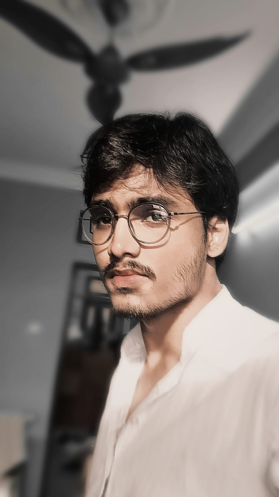

<!--  -->

# Mohammed Ahmed Burhanuddin Nayeem

### Computer Science & Engineering Graduate | Full-Stack Developer in Training

Aspiring developer from Hyderabad who enjoys building clear, useful, and responsive digital experiences.

  <a href="index.html"><strong>Visit my portfolio</strong></a>
  &nbsp;&nbsp;·&nbsp;&nbsp;
  <a href="About.html"><strong>About me</strong></a>
  &nbsp;&nbsp;·&nbsp;&nbsp;
  <a href="projects.html"><strong>View my work</strong></a>

  
  
  
  

<!-- 

  

 -->

## About me

I am **Mohammed Ahmed Burhanuddin Nayeem**, a Computer Science and Engineering graduate from Osmania University, Hyderabad, with a CGPA of **7.5**. I am currently developing my full-stack skills through MERN training and practical work across web development, REST APIs, databases, artificial intelligence, and machine learning.

I like turning ideas into interfaces that are easy to understand and useful to real people. My approach combines logical problem-solving with attention to responsive layouts, accessible interactions, and maintainable code.

> **Based in:** Hyderabad, Telangana, India 
> **Focus:** Full-stack web development 
> **Interests:** Artificial intelligence, machine learning, responsive UI, and practical software solutions

## What I bring

<table>
<tr>
<td width="50%">

### Technical foundation

- Python and JavaScript development
- Semantic HTML and responsive CSS
- React, Next.js, Node.js, and Express.js
- MongoDB, REST APIs, and FastAPI
- Data work with Pandas and Scikit-learn

</td>
<td width="50%">

### Personal strengths

- Clear and patient communication
- Logical approach to problem-solving
- Curiosity and continuous learning
- Interest in practical, purposeful products
- Ability to explain technical ideas simply

</td>
</tr>
</table>

## My portfolio

The portfolio website is designed as a complete introduction to my background, interests, and development journey. Each page focuses on a different part of who I am and how I work.

<table>
<tr>
<th>Page</th>
<th>Open</th>
<th>What it says about me</th>
</tr>
<tr>
<td><strong>Home</strong></td>
<td><a href="index.html">index.html</a></td>
<td>My introduction, location, skills, interests, and ways to connect</td>
</tr>
<tr>
<td><strong>About</strong></td>
<td><a href="About.html">About.html</a></td>
<td>My background, values, technologies, experience, and learning path</td>
</tr>
<tr>
<td><strong>Projects</strong></td>
<td><a href="projects.html">projects.html</a></td>
<td>Practical work that reflects my growth across web development and AI</td>
</tr>
<tr>
<td><strong>Responsive test</strong></td>
<td><a href="responsive-test.html">responsive-test.html</a></td>
<td>My attention to usability across mobile, tablet, and desktop screens</td>
</tr>
</table>

## Education and experience

<table>
<tr>
<td width="33%">

### Computer Science & Engineering

**Osmania University, Hyderabad** 
B.E. / B.Tech 
CGPA: **7.5**

</td>
<td width="33%">

### Full-Stack Training

**Career Guidance Council, Talent Development Center** 
MERN stack, Next.js, AI concepts, APIs, databases, and application architecture.

</td>
<td width="33%">

### Physics Tutor

**Abduls Academy** 
Supported secondary school students with physics concepts and numerical problem-solving.

</td>
</tr>
</table>

My tutoring experience strengthened my communication, presentation, mentoring, and ability to adapt explanations to different learning needs. These skills influence how I collaborate and how I think about user-friendly software.

## Technical interests

| Area | Technologies and interests |
| --- | --- |
| Front end | HTML, CSS, JavaScript, React, Next.js, responsive UI |
| Back end | Node.js, Express.js, Python, FastAPI, Flask, REST APIs |
| Data and AI | Python, Pandas, Scikit-learn, machine learning, predictive modelling |
| Databases and tools | MongoDB, Git, GitHub, practical application architecture |
| Human skills | Communication, mentoring, problem-solving, continuous learning |

## Selected learning work

My projects are part of my learning journey and show how I apply concepts through hands-on practice. They include fraud-detection workflows, machine-learning experiments, browser-based JavaScript tools, and responsive web development.

<table>
<tr>
<td width="50%">

### Building with Python and AI

I explore data preparation, predictive modelling, and application concepts that connect machine-learning ideas with useful interfaces.

<a href="https://github.com/Bunnyxdave/MDFDP"><strong>Explore fraud detection →</strong></a>

</td>
<td width="50%">

### Growing through web development

I practise creating responsive interfaces, working with APIs and databases, and organizing applications into clear, maintainable parts.

<a href="https://github.com/Bunnyxdave/MERNSTACK-TDC"><strong>Explore web development →</strong></a>

</td>
</tr>
<tr>
<td width="50%">

### Learning through experiments

Machine-learning and JavaScript projects help me test ideas, understand tools, and turn technical concepts into working results.

<a href="https://github.com/Bunnyxdave/ML-projects"><strong>See machine-learning work →</strong></a>

</td>
<td width="50%">

### Creating useful tools

I enjoy small, focused tools that solve a clear problem, such as browser-based utilities with simple, accessible interactions.

<a href="https://github.com/Bunnyxdave/JavaScript-beginners"><strong>See JavaScript work →</strong></a>

</td>
</tr>
</table>

## How I work

- I start by understanding the purpose of a feature and the people who will use it.
- I value simple structures that are easy to read, test, and improve.
- I pay attention to responsive behavior so an experience remains useful on different screens.
- I keep learning through practical projects, training, and experimentation.
- I believe good communication is as important as good implementation.

## Contact me

I am open to collaboration, training opportunities, and junior full-stack development roles.

  

<a href="mailto:mdburhan152004@gmail.com"><strong>Email me</strong></a>
&nbsp;&nbsp;·&nbsp;&nbsp;
<a href="https://github.com/Bunnyxdave"><strong>GitHub</strong></a>
&nbsp;&nbsp;·&nbsp;&nbsp;
<a href="https://www.linkedin.com/in/md-burhan-770867353"><strong>LinkedIn</strong></a>
&nbsp;&nbsp;·&nbsp;&nbsp;
<a href="https://www.google.com/maps/search/?api=1&query=Hyderabad%2C+Telangana%2C+India"><strong>Hyderabad, India</strong></a>

## About this website

This personal portfolio is a lightweight static website built with semantic HTML, CSS, and vanilla JavaScript. It includes a responsive navigation menu, fluid layouts, accessible page structure, project links, and reduced-motion support. There is no build process or package installation required.

### Web : 
<a href="https://burhan-portfolio-rouge.vercel.app">Burhan-portfolio.in</a>

Made with HTML, CSS, JavaScript, curiosity, and a focus on clear digital experiences.

